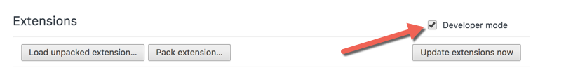
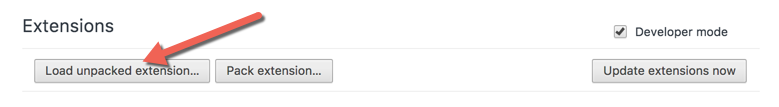

## VICE Google Analytics Debugger Chrome Extension

### How to install
1. Download the latest release copy and unzip it.
2. Open Chrome browser and go to `chrome://extensions/`
3. Make sure the `Developer mode` box is checked off:

4. Click on `Load unpacked extension`:

5. Locate the unpacked extension file and select the `build` folder.  
*The app is built with react so the other files are needed to compile the extension*

### How to use
1. Open Chrome browser
2. Load a `vice.com` website, then click on the VICE Icon in the Chrome Extensions

3. Look for Google Analytics Network calls

### Options
By default the extension will use generic labels for Custom Dimensions, Custom Metrics, and Content Groups.  

These generic labels can be updated to reflect the actual GA mappings.

1. Go to the file `public/gaConfg.json` and copy the JSON object
2. Then right click on the Chrome Extension and select the Options setting

3. Paste the JSON object into the text box and hit save.

