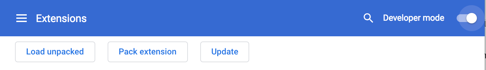
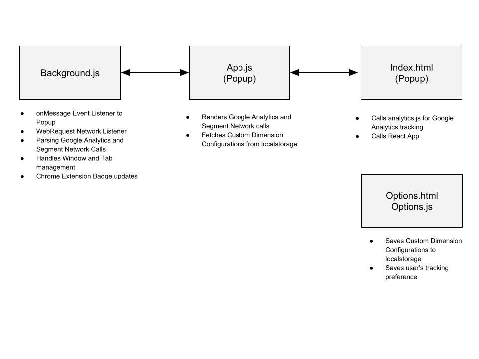
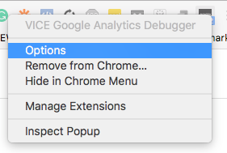

# Google Analytics and Segment Helper - Chrome Extension
The Google Analytics and Segment Helper - Chrome Extension is designed to help site admins troubleshoot Google Analytics and Segment calls on any site.  

Here is the link to the project in the [Chrome Extension Webstore](https://rebrand.ly/errorb7136)  
Here is the link to our [medium post](https://rebrand.ly/troubae824) that walks through why we built the extension  

  

Troubleshooting site analytics is an extremely tedious task, especially when you are checking multiple events and custom dimensions.  This chrome extension, analyzes the webRequests made from a webpage to Google Analytics and Segment, and displays the webRequests in an easy to read manner, so users can easily see what calls are being made, and dive deeper into the specific call's metadata if they need to.

Some of the unique features of this chrome extension are...

- Facilitates Google Analytics Tracking on Google AMP Pages
- WebRequests are intuitivily grouped based on Google Analytics Tracking IDs and Segment Write Keys
- Users can Pop-out the Chrome Extension into it's own window for easier troubleshooting
- Users can upload their Custom Dimension configuration via Chrome Extension Options for easier reference.

## Table of Contents
- [Getting Started](#getting-started)
  - [Prerequisites and installation](#prerequisites-and-installation)
  - [Notes on internals/approach](#notes-on-internalsapproach)
  - [Options](#options)
- [Versioning](#versioning)
- [Guidelines for Contribution](#guidelines-for-contribution)
- [Dependencies / Acknowledgements](#dependencies--acknowledgements)
- [Contact](#contact)

## Getting Started
### Prerequisites and installation
- The chrome extension is built using "Create React App" framework ([https://github.com/facebook/create-react-app](https://github.com/facebook/create-react-app)).
- Any changes should be made to the files within the `public` or `src` folders.
- When you are ready to build, initiate the build process by running
 ``` npm run build ```
- After the build process is complete, the `build` folder will have been updated.
- To test your latest changes, within your chrome browser type in `chrome://extensions` in the URL field.
- Make sure you turn on **Developer Mode**

- The select **Load unpacked** and select the `build` folder.

### Notes on internals/approach
The tool leverages Chrome Extension components - Background script, Popup, and Options, and requires WebRequest, LocalStorage, and Tabs permissions.

To make the Popup component update dynamically as network requests are made, the Popup component is development using React.js

```bash
├── README.md
├── node_modules
├── package.json
├── .gitignore
├── public
│   ├── background.js                 // Chrome Extension Background Script
│   ├── index.html                    // Chrome Extension Popup HTML
│   ├── manifest.json                 // Chrome Extension Manifest.json
│   ├── options.html                  // Chrome Extension Options.html
│   ├── options.js                    // Chrome Extension Options.js
│   ├── gaConfigSample.js             // Sample Custom Dimension configuration
│   └── images                        // image assets - favicon
└── src
    ├── App.css                        // React App CSS
    ├── App.js                         // React App Main JS
    ├── App.test.js
    ├── index.css
    ├── index.js
    ├── registerServiceWorker.js
    ├── common
    │	└── Utils.js                    // script to retreive custom dimension mapping
    └── images							// Popup image assets
```

Here is a diagram on what each of the components do


### Options
By default the extension will use generic labels for Custom Dimensions, Custom Metrics, and Content Groups.  

These generic labels can be updated to reflect the actual GA mappings.



1. Then right click on the Chrome Extension and select the Options setting
2. Update the following JSON to meet your Google Analytics Custom Groups, Custom Dimensions, and Custom Metrics.

```
{
  "UA-XXXXXX-YY":{
    "contentGroups" :{
      "cg1":"Article UID",
      "cg2":"Topics"
    },
    "customDimensions" :{
      "cd1":"Article UID",
      "cd2":"Topics"
    },
    "customMetrics" :{
      "cm1":"Video Plays - Manual",
      "cm2":"Video Plays - AutoPlay"
    }
  }
}
```
Sample file can be located `public/gaConfigSample.json`

3. Paste the JSON object into the text box and hit save.


## Versioning
We follow the [Semantic Versioning](https://semver.org/) convention where a version number is composed of MAJOR.MINOR.PATCH where we increment each with the following rules:

- MAJOR version when you make incompatible API changes,
- MINOR version when you add functionality in a backwards-compatible manner, and
- PATCH version when you make backwards-compatible bug fixes.

## Guidelines for Contribution
Contributions, big or small, are welcome. If you have a suggestion for a feature or an issue with the library please feel free to make a Github issue so that we can be made aware of it. If you have written something that you think would be a good addition we would love you to make a PR so that we can work together to see if the changes can be integrated.

## Dependencies / Acknowledgements
In building this project, I borrowed heavily from...
- Building a Chrome Extension Using React - https://medium.com/@gilfink/building-a-chrome-extension-using-react-c5bfe45aaf36
- This project is also built with Create React App - https://github.com/facebook/create-react-app
