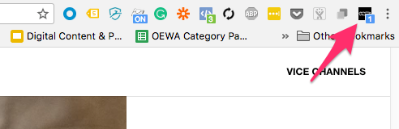
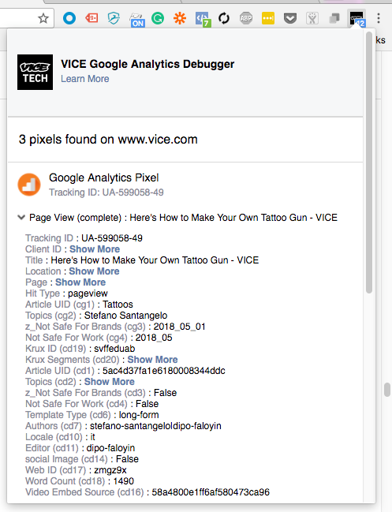
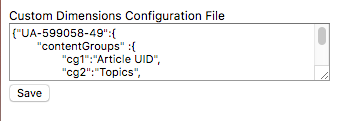

## Google Analytics and Segment Chrome Extension Debugger

Here is the link to the project in the [Chrome Extension Webstore](https://chrome.google.com/webstore/detail/google-analytics-and-segm/fdagjpflogmjegjmcgfdkdpbboiefdgj)

The Google Analytics and Segment Chrome Extension Debugger is designed to help site admins troubleshoot Google Analytics and Segment calls on any site.

Troubleshooting site analytics is an extremely tedious task, especially when you are checking multiple events and custom dimensions.  This chrome extension, analyzes the webRequests made to Google Analytics and Segment, and displays the webRequests in an intuitive easy to read manner, so site admins can easily see what calls are being made, and dive deeper into the specific call's metadata if they need to. 

Some of the unique features of this chrome extension are...

- Facilities GA Tracking on AMP Pages
- WebRequests are intuitivily organized in the hierarchy based on Google Analytics Tracking IDs and Segment Write Keys
- Users can Pop-out the Chrome Extension into it's own window for easier troubleshooting
- Users can upload their Custom Dimension configuration for easier reference.

### Getting Started
##### Prerequisites, installation
- The chrome extension is built using "Create React App" framework ([https://github.com/facebook/create-react-app](https://github.com/facebook/create-react-app)).
- Any changes should be made to the files within the `public` or `src` folders.
- When you are ready to build, initiate the build process by running
 ``` npm run build ```
- After the build process is complete, the `build` folder will have been updated.
- To test your latest changes, within your chrome browser type in `chrome://extensions` in the URL field.
- Make sure you turn on Developer Mode

The select Load unpacked and select the build folder.

##### Notes on internals/approach
The Chrome Extension leverages a combination of Chrome's background script, Popup, and Options components, and requires WebRequest, LocalStorage, and Tabs permissions. 

To make the Popup component update dynamically as network requests are made, the Popup component is development using React.js

```bash
├── README.md
├── node_modules
├── package.json
├── .gitignore
├── public
│   ├── background.js                 // Chrome Extension Background Script
│   ├── index.html                    // Chrome Extension Popup HTML
│   ├── manifest.json                 // Chrome Extension Manifest.json 
│   ├── options.html                  // Chrome Extension Options.html
│   ├── options.js                    // Chrome Extension Options.js
│   ├── analytics.js                  // User Tracking 
│   ├── google-analytics-bundle.js    // Google Analytics Tracking Library
│   └── images                        // image assets - favicon
└── src
    ├── App.css                        // CSS for the React App
    ├── App.js                         // JS for the React App 
    ├── App.test.js
    ├── index.css
    ├── index.js
    ├── index.js
    ├── registerServiceWorker.js
    ├── common
    │	└── Utils.js                    // script to retreive custom dimension mapping
    └── images							// image assets for Popup
```

Here is a diagram on what each of the components do


### How to use
1. Open Chrome browser
2. Load a `vice.com` website, then click on the VICE Icon in the Chrome Extensions

3. Look for Google Analytics Network calls


### Options
By default the extension will use generic labels for Custom Dimensions, Custom Metrics, and Content Groups.  

These generic labels can be updated to reflect the actual GA mappings.

1. Go to the file `public/gaConfg.json` and copy the JSON object
2. Then right click on the Chrome Extension and select the Options setting

3. Paste the JSON object into the text box and hit save.

